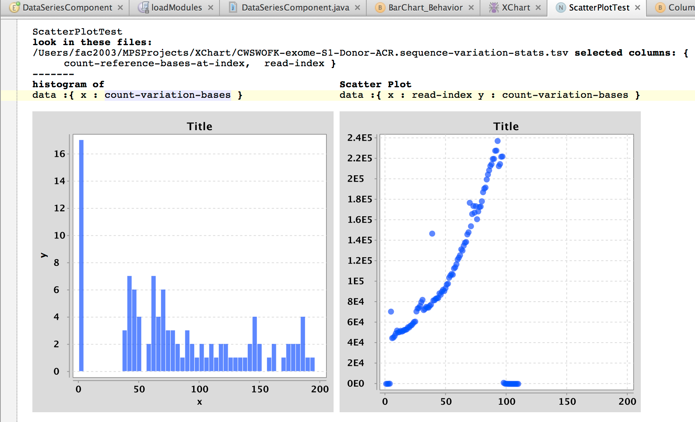

  
Language wrapping XChart (https://github.com/timmolter/XChart). Makes it possible to preview charts constructed from data in TSV and other delimited text files, and to produce an implementation of the charts that can display the content of new files with similar columns. 

See https://github.com/CampagneLaboratory/XChart  

The language lets you preview the plots that will be generated. Below is a Page node with two charts, showing previews for a histogram and a scatterplot.

Building this node will generate Java code that renders the two plots given filenames of files that contain such columns. We use this language to quickly assemble charts that we can connect to data files generated by [GobyWeb](gobyweb.campagnelab.org).